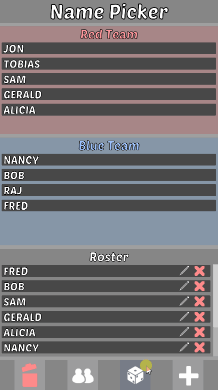

# Name Picker
This is a utility app to assist with picking names from a roster list and/or pairing teams when with a group of people for uses such as social situations.

- Unity Version: 2021.3.5f1 (LTS)
- Tested on Android only
- [Poetsen One Font (100% Free)](https://www.dafont.com/poetsen-one.font?l[]=10&l[]=1)
- [Kenney's Game Icons 100% Free](https://kenney.nl/assets/game-icons)

### Features
- Custom name adding to the roster list
- Support for ordered and teams of 2, 3 or 4
- Unequal team handling
- Data saved to JSON format between sessions for cold data storage
- Randomise order button
- Remove all records button
- Remove and edit individual names from the roster
- Dynamic UI with scroll list handling for overflow